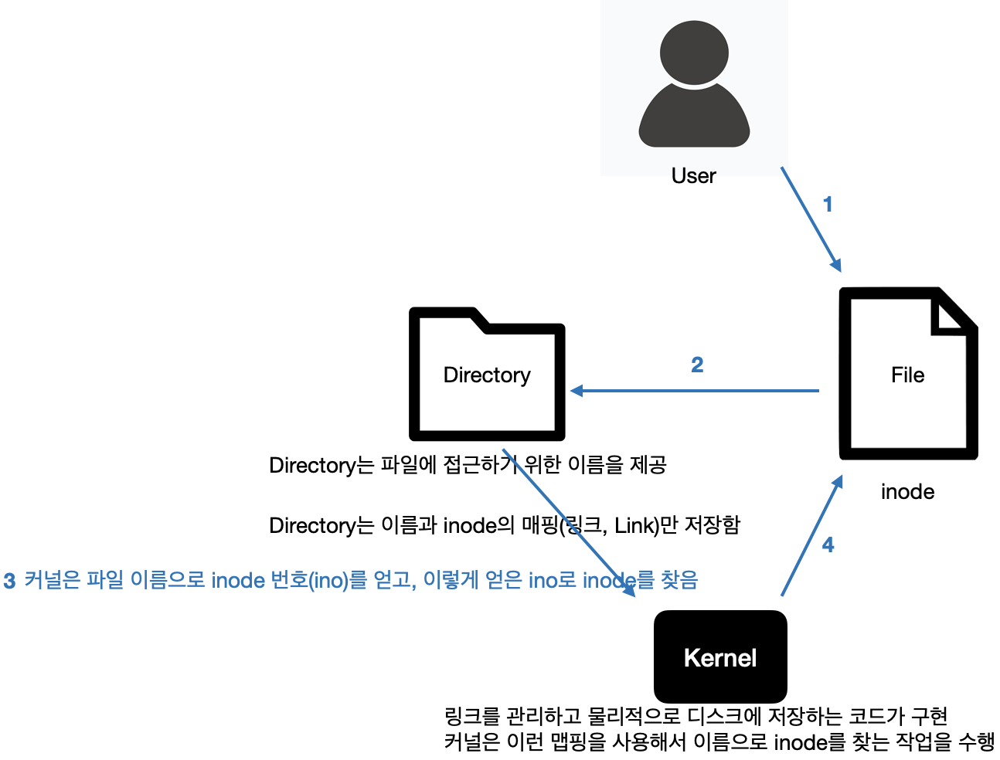
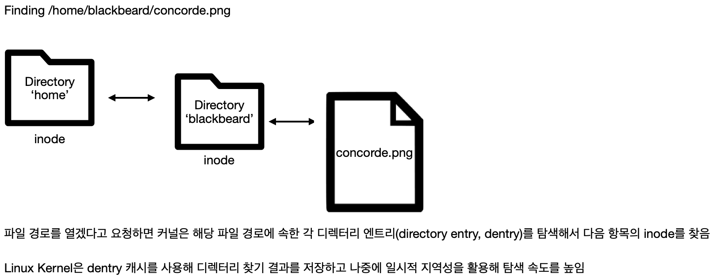

# Linux System Programming

## Linux programming Basic concept
### 파일과 파일 시스템
- **파일**
  - 파일은 리눅스에서 가장 기본적이고 핵심이 되는 추상화 개념. 리눅스는 모든 것이 파일이라는 철학을 따름 
모든 인터렉션은 실제로 파일이 아닌 것처럼 보일지라도 파일을 읽고, 파일에 쓰는 것으로 이뤄짐 
- **파일 디스크립터**
  - 파일은 그 파일에 대한 메타데이터와 연결된 고유한 기술자를 통해 참조됨 이 기술자(descriptor)를 파일 디스크립터(file descriptor)라고 부르며 **fd**라고 부름
  - 파일 디스크립터는 사용자 영역에서 공유되며 응용 프로그램이 파일에 접근할 때 직접 사용됨
- 일반 파일
  - 일반 파일은 byte stream이라고 부르는 연속적으로 나열된 바이트 배열에 저장된 데이터를 의미
  - 파일은 바이트를 읽고 쓰는것이 가능한데 이런 작업은 파일 내부의 위치를 지정해서 수행할 수 있다. 이 위치를 **파일 오프셋(file offset)** 혹은 **파일 위치(file position)** 이라 함. 보통 파일은 바이트 단위로 읽고 쓰기 때문에 파일 오프셋 역시 바이트 단위로 증감소가 일어남
  - 파일 오프셋은 0부터 시작하며 음수값이 될 수 없음. 파일 중간에 데이터 기록시 전에 있던 데이터를 덮어씀. 따라서 파일 중간에 데이터를 쓰는 방법으로 파일을 확장하는 것은 불가능 함. 파일을 쓰는 작업 대부분은 파일 끝에서 일어남
  - 하나의 파일은 다른 프로세스나 심지어 동일한 프로세스에서 한 번 이상 여는 것이 가능. 파일은 열릴 때마다 고유한 파일 디스크립터를 반환함. 반대로 프로세스에서는 파일 디스크립터 공유가 가능. 하나의 파일 디스크립터는 하나 이상의 프로세스에서 사용되는 것이 가능함.
  - 파일은 파일 이름으로 연관 되어 있지 않다. 파일은 **inode(information node)** 라고 하는 파일 시스템 내에서만 고유한 정수 값으로 참조됨.이 고유한 정수 값은 inode 번호라고 하며 ino(i-number)라고 줄여씀. **==> inode: 파일 시스템 / ino: inode 파일 시스템에서 파일에 접근하기 위한 고유 정수 값**
  - inode는 변경된 날짜, 소유자, 타입, 길이, 데이터 저장 위치 같은 파일에 관련된 메타데이터를 저장하지만 파일 이름은 저장하지 않음
- **디렉터리와 링크**
  - 디렉터리는 파일에 접근하기 위한 이름을 제공, 디렉터리는 inode 대신에 사람이 읽을 수 있는 이름으로 나타냄
  - **링크(Link)** : 사람이 읽을 수 있는 이름과 컴퓨터가 읽을 수 있는 이름인 inode 쌍
  - 사용하는 파일시스템에 맞게 이 링크를 관리하고 물리적으로 디스크에 저장하는 코드가 커널에 구현되어 있음, 개념적으로 /**디렉터리는 일반 파일과 유사한 모습이지만 이름과 inode의 맵핑만 저장한다는 점에서 차이가 존재함** 커널은 이런 맵핑을 사용해서 이름으로 inode를 찾는 작업을 수행함
  - 사용자 영역 애플리케이션에서 어떤 파일을 열겠다고 요청하면 커널은 파일 이름이 포함된 디렉터리를 열고 파일을 찾음. 커널은 파일 이름으로 inode 번호를 얻고, 이렇게 얻은 inode번호로 inode를 찾음.
 
  -  디렉터리또한 inode가 존재함. 디렉터리 내부의 링크 역시 다른 디렉터리의 inode를 가리킬 수 있다. 즉 디렉터리는 다른 디렉터리 내부에 존재할 수 있고 계층적인 구조를 형성할 수 있게 된다.
  -  실제 Directory도 inode가 존재. 디렉터리 내부의 링크 역시 다른 디렉터리의 inode를 가리킬 수 있다. 즉 디렉터리는 다른 디렉터리 내부에 존재할 수 있고 계층적 구조를 형성할 수 있다.
 
  - Directory를 일반 파일처럼 취급하지만 커널은 사용자 영역에서 디렉터리를 일반 파일처럼 열고 조작하지 못하도록 제한. 디렉터리는 특수한 시스템 콜을 활용해 조작해야 하는데 시스템 콜로는 링크 추가와 삭제가 있음
- **하드 링크**
  - 다중 링크는 동일한 inode에 대한 여러가지 이름을 맵핑함. 이를 하드링크라고 함
  - 하드 링크는 복잡한 파일시스템 구조에서 동일한 데이터를 여러 경로 이름이 가리킬 수 있게 허용
-  **파일 삭제**
   -  파일 삭제는 디렉터리 구조에서 링크를 해제하는 작업에 관여, 파일 삭제는 단순히 디렉터리에서 이름과 inode쌍을 삭제하면 끝남 But, 리눅스는 하드링크를 지원하여 파일 시스템은 링크를 해제할 때마다 inode와 관련 자료를 삭제할 수 없음. 파일 시스템 내에 다른 하디링크가 존재한다면 모든 링크가 삭제될 때까지 파일을 삭제하지 못하도록 보장하기 위해 각 inode는 파일 시스템 내부에 링크 카운터를 두어 자신을 가리키는 링크 개수를 추적함. 파일 이름의 링크가 해제하면 링크 카운터가 하나 감소하여 링크 카운트가 0이 되면 파일 시스템에서 inode와 관련 자료를 실제롤 삭제함